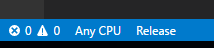
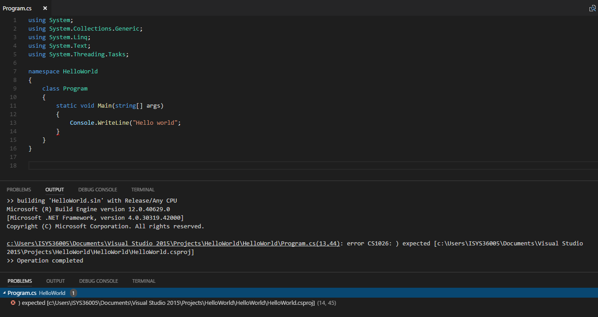

# vs-solution-support README

Welcome to the vs-solution-support readme.
This extension is bringing some concept of Visual Studio to Visual Studio Code and the goal is to support doing WPF/C# development via vscode.

## Features
- Ability to pick a solution file - manually 
- Simple solution explorer
    At the moment the solution explorer displays only the solution node and for each projects:
    * Project Referencies
    * Nuget packages
    * Items (link items are not supported)
- Allow to build solution from VSCode
    * Active  platform & configuration are displayed in the status bar
    
    * Error are reported in both output and error list:
    
- Render projects dependencies within the solutoin
    

## Requirements

This rely on dotnet cli and need to be installed and msbuild to be available on command line.

## Extension Settings

Configuration points :

 - solutionExplorer.file : solution to be used.
 - solutionExplorer.configuration : which configuration (debug/release) to be build.
 - solutionExplorer.platform : which platform (ANy CPU,...) to be build.

## Known Issues

## Release Notes

### 0.0.1

First cut !

